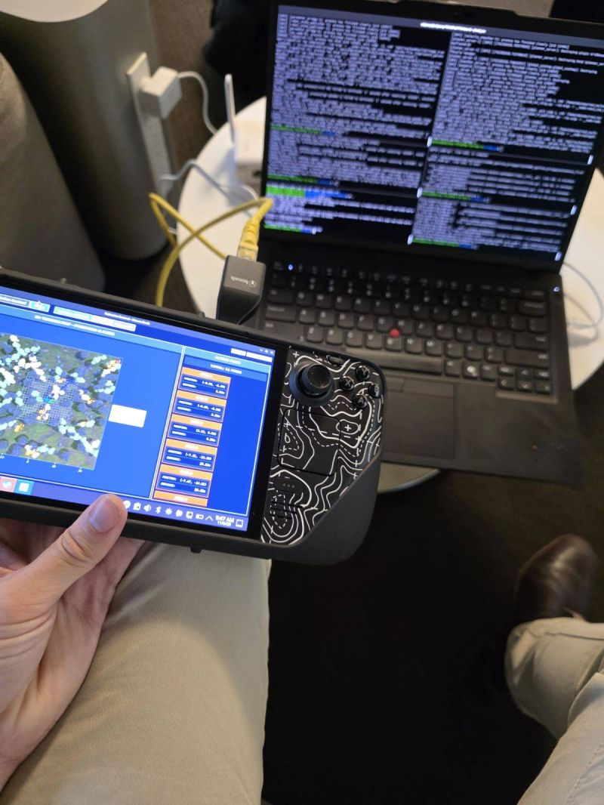
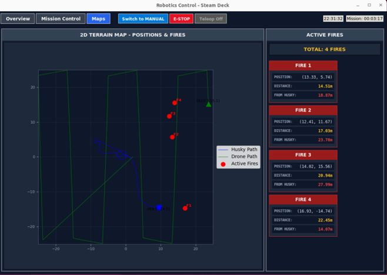
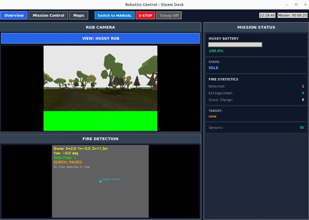

# 41068_Robotics_Studio_1
Codebase for Robotic Studio 1 Project
This was a robust scalable robotics concept to enhance safety and operational efficency for frontline agencies such as the Rural Fire Service, and NSW National Parks & Wildfire Service. =

 
## How it works
 Our demonstration combines a UAV for autonomous aerial fire scanning and sweeping using RGB and IR camera inputs, with a UGV that autonomously navigates to identified fires and extinguishes them using a LiDAR‑based SLAM and Nav2 stack. Both platforms are orchestrated via a unified ROS 2‑based GUI.

The full workflow from fire detection to UGV deployment and suppression is simulated with Gazebo Ignition and developed entirely in ROS 2, enabling repeatable testing and rapid iteration.

UAV: Autonomous aerial sweep, RGB + IR inputs, fire localisation & bounding.

UGV: LiDAR SLAM, Nav2‑based navigation, autonomous fire approach & extinguishing behaviour.

GUI: Central mission control tying together perception, planning, telemetry, and teleoperation.

## Images from our project
 

 
## Gallery
 
| | |
|---|---|
|  |  | 
 
